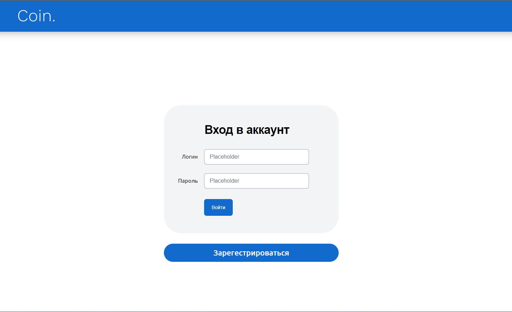
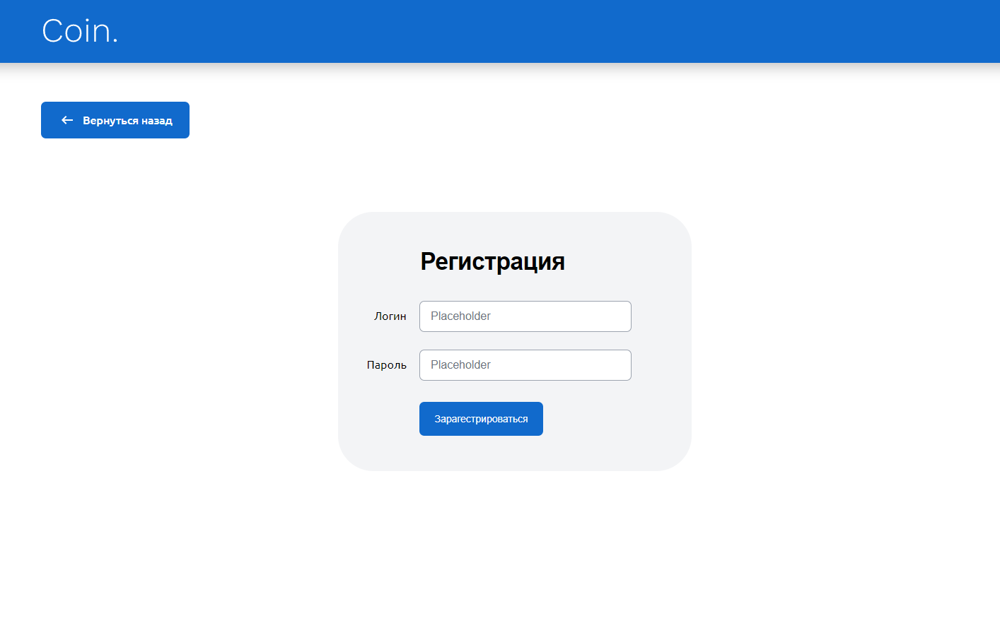
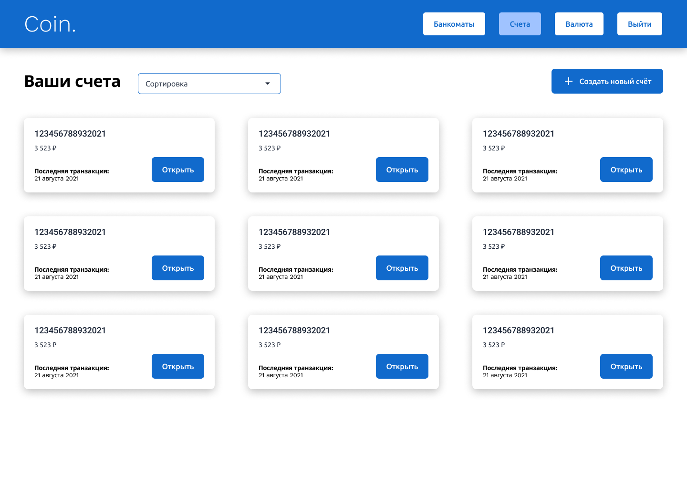
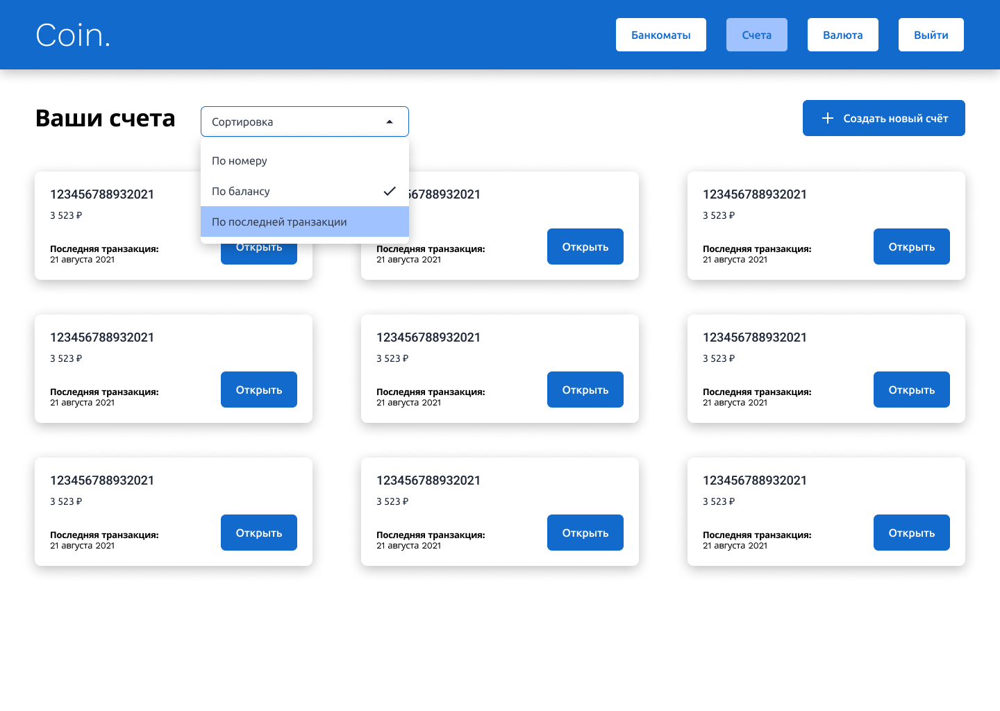
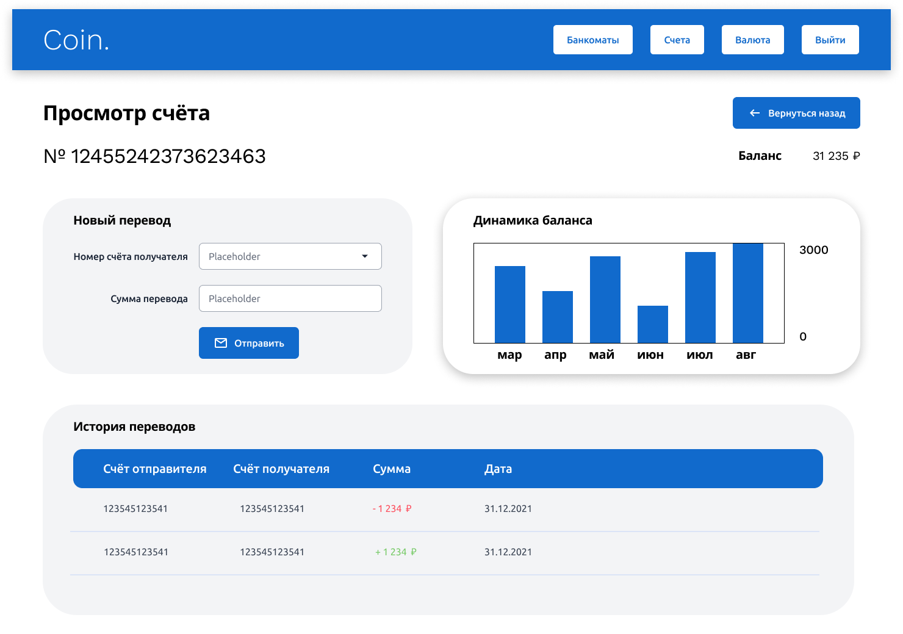
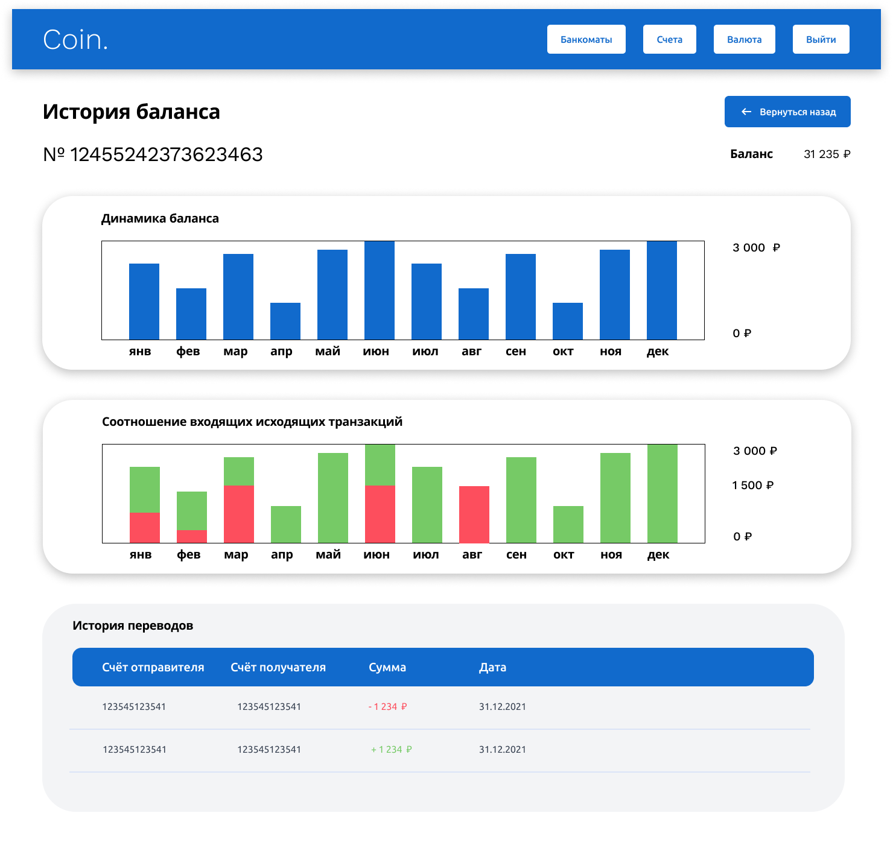
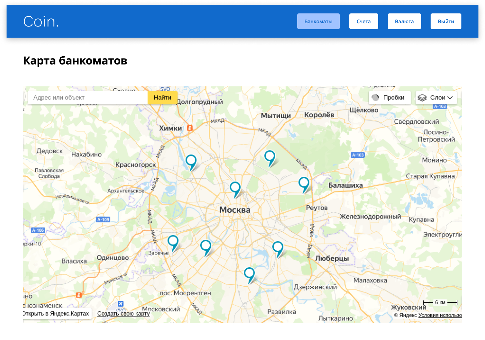

# Coin app
Coin is an application that provides banking service. It's built on React.js and uses TypeScript for safety,
Redux for state management, react-router-dom library for routing.















## Usage
- Enter your data to signup/login. Then you will be redirected to the home page
- Click on 'Создать новый счёт' button to create your first account
- If you already have an account then click on 'Открыть' button to see more information about the account
- If you have already clicked on 'Открыть' button then click on balance graphics or transactions history to see the full information about your balance and transactions
- Click on 'Банкоматы' button in the navigation menu to see the map of banks location

## Setup
```
$ npm install
$ npm run dev
```

## Author
Marian Roshchupkin &lt;roshchupkin.marian@gmail.com&gt;

Updated on: 13 August 2023

## License
MIT - see [LICENSE](LICENSE)