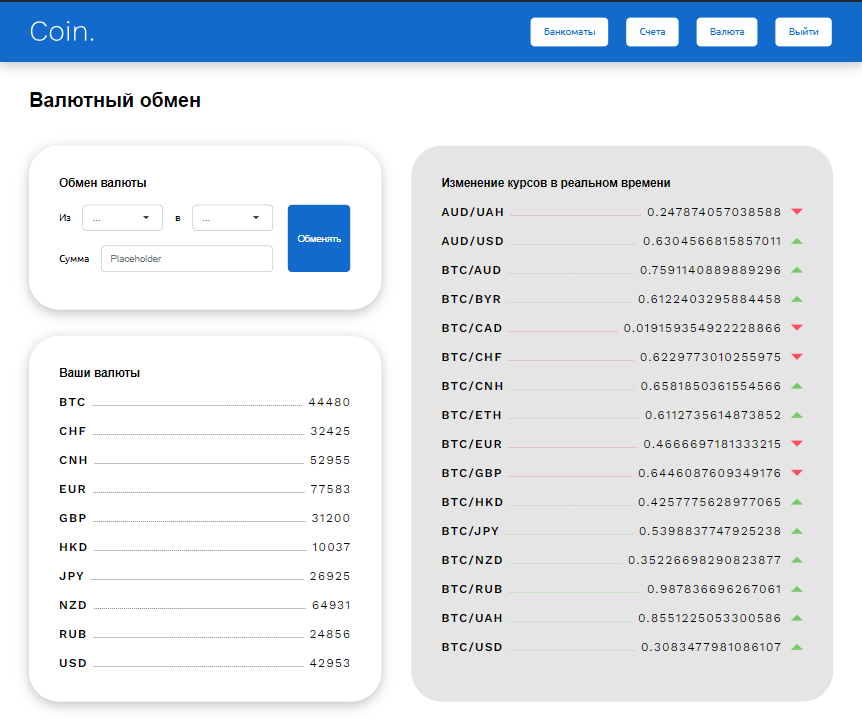

# Coin app
A simple social network app that is built on React.js. It uses TypeScript for safety,
Redux for state management, react-router-dom library for routing.





## Usage
- Enter your data to signup/login. Then you will be redirected to the home page
- Click on 'Моя страница' button in navigation menu or on icon on top right corner to see your profile page
- If you have entered the data about yourself then you will see the information about yourself like city, university and your age
- If you haven't entered the data about yourself yet then click on 'Редактировать профиль' button to update your profile data
- If you want to upload the avatar image then click on a huge anonymous icon. The modal will appear to let you upload you image. Unfortunately, this option is still in development mode

## Setup
```
$ npm install
$ npm run dev
```

## Author
Marian Roshchupkin &lt;roshchupkin.marian@gmail.com&gt;

Updated on: 9 August 2023

## License
MIT - see [LICENSE](LICENSE)